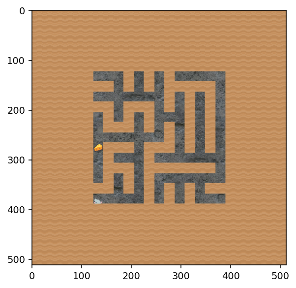
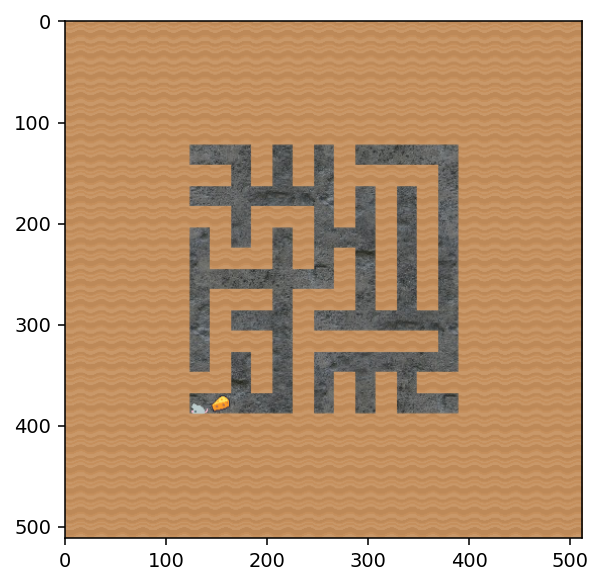
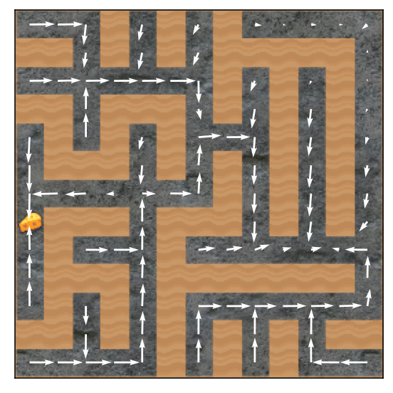
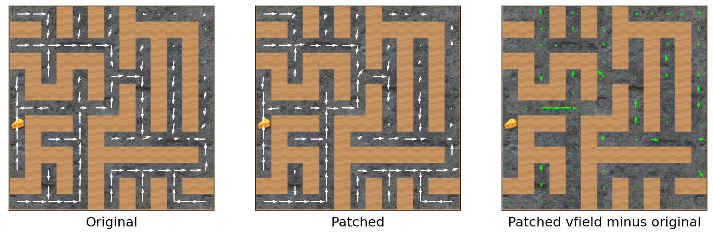

## procgen-tools

Code for a series of experiments and associated tools for interpreting
agents trained on _procgen_, specifically the `maze` environment as used
in [Goal Misgeneralization in Deep Reinforcement
Learning](https://arxiv.org/abs/2105.14111) by Longosco et al. The
pretrained models are available in [this Google Drive
folder](https://drive.google.com/drive/folders/1Ig7bzRlieyYFcdKL_PM-guSWR8WryDOL?usp=sharing)
(we analyzed the `maze_I/*.pth` models).

This repository was initially created by the shard theory team during the SERI MATS 3.0 research fellowship program.

**Disclaimers:** *this repository is a work-in-progress research codebase
built to produce results quickly. It lacks tests and proper
documentation, and will likely undergo interface-breaking refectorings
several times as this research continues. We hope it's a helpful
resource nonetheless! If this code is useful or you'd like to contribute
to this work, we'd love to hear from you! 

Furthermore, we sometimes edit activations during forward passes. The
repository sometimes erroneously calls this "patching" (which are sets
of [_resampled_ activations](https://www.alignmentforum.org/posts/xh85KbTFhbCz7taD4/how-to-think-about-activation-patching)), even though we aren't always editing
activations by resampling activations.*

The repository is organized as follows:
- `experiments` contains research materials considered interesting or significant enough to (eventually) be documented and shared.
- `playground` contains early-stage or work-in-progress research, or archival materials for discontinued research threads.
- `procgen_tools` is a Python package containing the shared tooling used by the above research.  It can be installed from local source using `pip install -e procgen-tools`

Required dependencies should be installed using `pip install -r requirements.txt`.  

Data dependencies (cached episode data, etc.) will be downloaded
automatically when needed. 

### Code Associated with Publications

Check out the following `ipynb` notebooks in `experiments/`:
- `cheese_vector` and `top_right_vector` demonstrate the algebraic value
  editing technique whereby simply-computed activation-vectors are subtracted
  during the forward passes used to navigate the maze. For example, subtracting the "cheese vector" roughly
  makes the agent ignore the cheese in many levels.
- `behavioral_demos` allows interactive generation of mazes, and
  displays what decisions the trained policy makes in each maze.
- The `statistics/behavioral_stats` notebook runs a comprehensive suite
  of behavioral statistics to test what maze features tend to affect
  whether the agent approaches the cheese, or not.
- `cheese_scrubbing` applies Redwood Research's "[causal scrubbing](https://www.alignmentforum.org/posts/JvZhhzycHu2Yd57RN/causal-scrubbing-a-method-for-rigorously-testing)"
  technique in order to gain evidence on what behavior-relevant information is
  used by certain residual addition
  channels partway through the network. 
- `visualize_activations` is a (presently incomplete) notebook with a
  tool that allows editing a maze, and seeing how edits affect policy
  behavior and internal activations. 


### Key Features

#### Maze State Parsing, Editing and Updating

Code for parsing, editing and updateing maze state can be found in [procgen/maze.py].  A few usage examples are below.

Create an environment, parse the state and show all the accessible state variables, and show a rendering of the initial frame:


```python
import matplotlib.pyplot as plt
from procgen_tools import maze
# Create a maze environment
venv = maze.create_venv(1, start_level=0, num_levels=1)
# Parse the environment state
env_state = maze.state_from_venv(venv, 0)
# Display state values
print(env_state.state_vals.keys())
# Show a rendering of the first
venv.reset()
render = venv.render(mode='rgb_array')
plt.imshow(render)
plt.show()
```

    dict_keys(['SERIALIZE_VERSION', 'game_name', 'options.paint_vel_info', 'options.use_generated_assets', 'options.use_monochrome_assets', 'options.restrict_themes', 'options.use_backgrounds', 'options.center_agent', 'options.debug_mode', 'options.distribution_mode', 'options.use_sequential_levels', 'options.use_easy_jump', 'options.plain_assets', 'options.physics_mode', 'grid_step', 'level_seed_low', 'level_seed_high', 'game_type', 'game_n', 'level_seed_rand_gen.is_seeded', 'level_seed_rand_gen.str', 'rand_gen.is_seeded', 'rand_gen.str', 'step_data.reward', 'step_data.done', 'step_data.level_complete', 'action', 'timeout', 'current_level_seed', 'prev_level_seed', 'episodes_remaining', 'episode_done', 'last_reward_timer', 'last_reward', 'default_action', 'fixed_asset_seed', 'cur_time', 'is_waiting_for_step', 'grid_size', 'ents.size', 'ents', 'use_procgen_background', 'background_index', 'bg_tile_ratio', 'bg_pct_x', 'char_dim', 'last_move_action', 'move_action', 'special_action', 'mixrate', 'maxspeed', 'max_jump', 'action_vx', 'action_vy', 'action_vrot', 'center_x', 'center_y', 'random_agent_start', 'has_useful_vel_info', 'step_rand_int', 'asset_rand_gen.is_seeded', 'asset_rand_gen.str', 'main_width', 'main_height', 'out_of_bounds_object', 'unit', 'view_dim', 'x_off', 'y_off', 'visibility', 'min_visibility', 'w', 'h', 'data.size', 'data', 'maze_dim', 'world_dim', 'END_OF_BUFFER'])


    

    


Then, modify the cheese position, update the environment, and render again:


```python
maze.move_cheese_in_state(env_state, (6,7))
venv.env.callmethod('set_state', [env_state.state_bytes])
venv.reset()
render = venv.render(mode='rgb_array')
plt.imshow(render)
plt.show()
```


    

    


#### Interpretable, Parameter-Compatible Implementations of IMPALA Models

We use the `circrl` library to automatically apply forward hooks to pre-trained models, provide access to internal activations at all hidden layers, and apply activation edits and ablations of various kinds.  This library uses the pytorch `named_modules()` function to label and hook hidden layers.  The pretrained IMPALA models from the Goal Misgeneralization paper were implemented in such a way that certain important parameter-free modules (e.g. `ReLU()`s) were newly created at each forward call, making it difficult to apply hooks to extract the activations of these layers.  We implemented modified versions of these [models](procgen_tools/models.py) that create and name all modules during construction to facilitate later interpretability work.  The resulting model classes are parameter-compatible with the original pretrained models so `state_dict`s can be loaded unchanged.

#### Vector Field Visualizations

A key visualization that is used extensively in this research is the "vector field", a tool to show the agent's action probabilities when positioned at each free square in the maze, simultaneously.  We find this visualization superior to rollout-viewing in most cases as it removes stochasticity and visualizes agent behavior across a full maze in a single frame.  Vector fields can be show like so:


```python
import torch as t
from procgen_tools import maze, vfield, models

# Load pretrained policy
policy = models.load_policy('trained_models/maze_I/model_rand_region_5.pth', 15, t.device('cpu'))
venv = maze.create_venv(1, start_level=0, num_levels=1)
vf_original = vfield.vector_field(venv, policy)
vfield.plot_vf(vf_original)
plt.show()
```


    

    


From this visualization we can clearly see that at the "decision square" (the square at which the paths to the cheese and the top-right corner diverge, an important square when studying these goal-misgeneralizating agents), this agent will choose with fairly high probability to go towards the top-right corner.

Support is also provided for "vector field diff" visualizations, a tool for visualizing the effect of some kind of model intervention  on behavior within a given maze.  As an example, we'll add some random noise to a hidden layer in the model, and observe the effect on action probabilities:


```python
import circrl.module_hook as cmh
hook = cmh.ModuleHook(policy)
hooks = {'embedder.block2.res1.resadd_out': lambda outp: outp + 0.2*t.randn_like(outp)}
venv = maze.create_venv(1, start_level=0, num_levels=1)
with hook.use_patches(hooks):
    vf_modified = vfield.vector_field(venv, hook.network)
vfield.plot_vfs(vf_original, vf_modified)
plt.show()
```


    

    


#### Misc
- [Procgen wrappers](procgen_tools/procgen_wrappers.py) similifies environment-related dependencies
- [Patching utilities](procgen_tools/patch_utils.py) provides various patching-related utility functions
- [Rollout utilities](procgen_tools/rollout_utils.py) provides code to e.g. render side-by-side rollout videos
